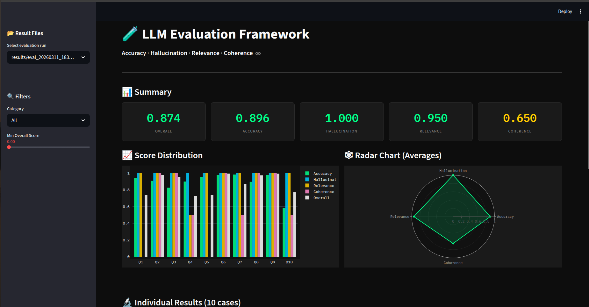

<div align="center">

# 🧪 LLM Eval Framework

**A comprehensive evaluation framework for LLMs and RAG pipelines — hallucination detection, LLM-as-a-judge scoring, semantic similarity, and a live dashboard.**

[](https://www.python.org/)
[](https://openai.com/)
[](https://huggingface.co/)
[]()
[](./LICENSE)

[⚡ Quick Start](#-quick-start) · [🧠 Evaluation Methods](#-evaluation-methods) · [📊 Dashboard](#-dashboard) · [🔌 What It Evaluates](#-what-it-evaluates)

</div>

---



*Dashboard showing a 10-case evaluation run — Overall: 0.874 · Accuracy: 0.896 · Hallucination: 1.000 · Relevance: 0.950 · Coherence: 0.650*

---

## 🌟 Overview

A modular, extensible evaluation framework for measuring the quality of **LLM responses** and **RAG pipelines**. Goes beyond simple string matching — combines LLM-as-a-judge scoring, semantic similarity, faithfulness checks, BLEU/ROUGE metrics, and cost/latency tracking, with all results surfaced in a live interactive dashboard.

Built for AI engineers who need rigorous, reproducible evaluation — not just vibes.

---

## 🔌 What It Evaluates

| Target | What Gets Measured |
|---|---|
| **RAG Pipelines** | Retrieval quality, answer groundedness, context coverage |
| **LLM Response Quality** | Accuracy, relevance, coherence, completeness |
| **Hallucination Detection** | Faithfulness to source — flags unsupported claims |
| **Prompt A/B Testing** | Side-by-side comparison of prompt variants |
| **Custom Tasks** | Pluggable scoring for domain-specific evaluation needs |

---

## 📊 Dashboard

The interactive dashboard surfaces all evaluation results in real time:

- **Summary cards** — Overall, Accuracy, Hallucination, Relevance, Coherence scores at a glance
- **Score Distribution** — per-question bar chart across all metrics
- **Radar Chart** — averaged score profile across all dimensions
- **Individual Results** — drilldown into each test case
- **Filters** — filter by category and minimum overall score
- **Evaluation run selector** — compare across multiple saved runs

---

## 🧠 Evaluation Methods

### 1. LLM-as-a-Judge
Uses GPT or Claude as an automated judge to score responses on accuracy, relevance, and coherence — returning structured scores with reasoning. Configurable judge model and scoring rubric.

### 2. Semantic Similarity
Computes embedding-based cosine similarity between generated responses and reference answers. Catches paraphrased correct answers that BLEU/ROUGE would miss.

### 3. Faithfulness / Groundedness Checks
Verifies that every claim in the generated response is supported by the retrieved context. Flags hallucinated statements not grounded in source documents.

### 4. BLEU / ROUGE Scores
Classic n-gram overlap metrics for benchmarking against reference answers — useful for regression testing and comparison against baselines.

### 5. Custom Scoring Functions
Pluggable scoring interface — define any task-specific metric and plug it into the evaluation pipeline without modifying core logic.

### 6. Latency & Cost Tracking
Records end-to-end response time and estimated token cost per evaluation run — essential for comparing models and prompt variants at scale.

---

## 🏗️ Architecture

```
Input (prompt + context + reference answer)
        │
        ▼
Evaluation Pipeline
        ├── LLM-as-a-Judge       → accuracy, relevance, coherence scores
        ├── Semantic Similarity   → embedding cosine similarity
        ├── Faithfulness Check    → hallucination detection
        ├── BLEU / ROUGE          → n-gram overlap scores
        ├── Custom Scorers        → pluggable task-specific metrics
        └── Latency / Cost        → token usage + response time
        │
        ▼
Results Aggregator → saves to results/eval_<timestamp>.json
        │
        ▼
Dashboard UI        → interactive live visualisation
```

---

## ⚡ Quick Start

### Prerequisites

- Python 3.10+
- OpenAI API key (for LLM-as-a-judge)

### 1. Clone and install

```bash
git clone https://github.com/overcastbulb/llm-eval-framework.git
cd llm-eval-framework
python -m venv .venv
source .venv/bin/activate    # macOS/Linux
# .\.venv\Scripts\activate   # Windows
pip install -r requirements.txt
```

### 2. Configure environment

```bash
cp .env.example .env
# Add your OPENAI_API_KEY to .env
```

### 3. Run an evaluation

```python
from eval import EvalPipeline

pipeline = EvalPipeline()

result = pipeline.evaluate(
    prompt="What are Apple's main risk factors?",
    response="Apple faces risks including supply chain disruption...",
    context="Apple's 10-K states that supply chain concentration...",
    reference="Key risks include supply chain, competition, and regulation..."
)

print(result.scores)
# {
#   "overall": 0.874,
#   "accuracy": 0.896,
#   "hallucination": 1.000,
#   "relevance": 0.950,
#   "coherence": 0.650
# }
```

### 4. Launch the dashboard

```bash
python dashboard.py
```

Open [http://localhost:8050](http://localhost:8050) — select any saved evaluation run from the sidebar to explore results.

---

## 📁 Project Structure

```
llm-eval-framework/
├── eval/
│   ├── pipeline.py            # Main evaluation orchestrator
│   ├── judge.py               # LLM-as-a-judge scorer
│   ├── similarity.py          # Semantic similarity (embeddings)
│   ├── faithfulness.py        # Hallucination / groundedness checks
│   ├── ngram.py               # BLEU / ROUGE metrics
│   ├── custom.py              # Pluggable custom scorer interface
│   └── tracking.py            # Latency and cost tracking
├── results/                   # Saved evaluation run JSONs
├── dashboard.py               # Dashboard UI entry point
├── .env.example
├── requirements.txt
└── README.md
```

---

## 🛠️ Tech Stack

| Component | Technology |
|---|---|
| Evaluation Engine | Python |
| LLM Judge | OpenAI GPT / Anthropic Claude |
| Embeddings | HuggingFace sentence-transformers |
| BLEU / ROUGE | `nltk` / `rouge-score` |
| Dashboard | Plotly Dash / Streamlit |
| Cost Tracking | OpenAI token usage API |

---

## 🗺️ Roadmap

- [ ] Support for additional judge models (Gemini, local Ollama)
- [ ] Batch evaluation across large datasets
- [ ] CI/CD integration — run evals as a GitHub Actions step
- [ ] Evaluation dataset builder and versioning
- [ ] PDF report export

---

## 📄 License

This project is licensed under the [MIT License](./LICENSE).

---

<div align="center">
  Built for AI engineers who need rigorous, reproducible LLM evaluation.
  <br/><br/>
  <a href="https://github.com/overcastbulb/llm-eval-framework/issues">Report a Bug</a> · <a href="https://github.com/overcastbulb/llm-eval-framework/issues">Request a Feature</a>
</div>
